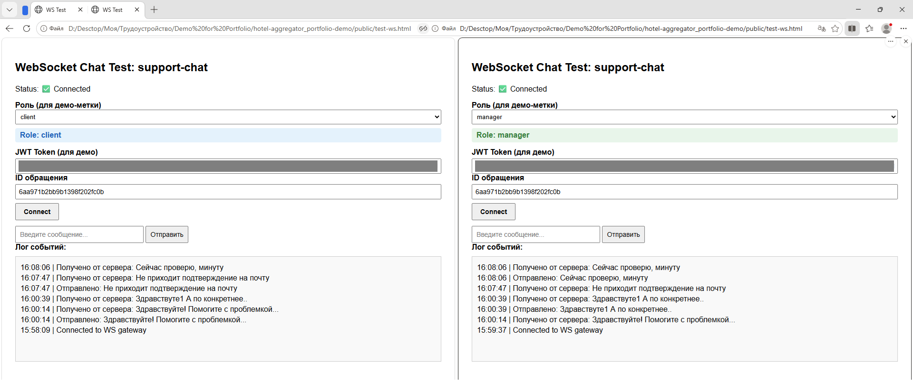

# Агрегатор гостиниц — демо-версия для портфолио

Дипломный проект (Нетология).  
Бэкенд на Nest.js: бронирование, чат в реальном времени (WebSocket), ролевая модель. 


**Статус:** демо-версия для рекрутеров (готовые тестовые аккаунты, быстрый запуск через Docker).


## Стек
- Node.js, Nest.js
- MongoDB
- WebSocket (Socket.IO),  
- Passport.js, bcrypt.js
- Docker  
- Swagger (OpenAPI)

## Быстрый запуск (Docker)
```powershell
docker run -p 3001:3001 --rm -e PORT=3001 -e MONGO_URL="<вставь строку Atlas>" -e JWT_SECRET="<Вставьте свой секретный ключ>" gronik4/hotel-aggregator_portfolio-demo:v01.02.0
```  
После запуска проект будет доступен по адресу: `http://localhost:3001`, а Swagger документация по адресу:  `http://localhost:3001/docs`.
   
### Важно  
- Для локальной разработки создайте файл '.env' по примеру файла '.env-example', его затем можно удалить.  
- Секреты (JWT_SECRET, MONGO_URL) не зашиты в образ — передаются через переменные окружения при запуске.  
- Папка imgStorage не входит в образ — файлы создаются динамически при загрузке через API.
  
### Тестовые аккаунты (для демо)  
Чтобы сразу проверить функционал (чат, бронирование, админку), используйте готовые аккаунты:  
Учетку админа не даю по понятным причинам.   
Пользователь(User): peter@yandex.ru / 12345  
  
###  Что можно проверить в демо  
- Авторизация и JWT‑токены  
- Ролевая модель и гварды  
- Чат в реальном времени через WebSocket  
- Бронирование и работа с сущностями  
- Swagger‑документация: `http://localhost:3001/docs`  
  
## Нюансы API

- При создании клиента через админ-эндпоинт пароль генерируется автоматически.  
- Пароль **не выводится** в JSON-ответе API — это мера безопасности.  
- Для проверки значения (только локально) смотрите логи сервера: пароль выводится в консоль при создании.
  
### Скриншот чата в реальном времени
    
  На скриншоте — обмен сообщениями в чате через Socket.IO (демонстрация realtime‑функционала)
  
Это демо-версия для рекрутеров. Основная дипломная версия (строго по ТЗ) находится [здесь](https://github.com/Gronik4/graduation-project_backend-development-with-node.js.git)  
  
### Контакты  
[GitHub портфолио](https://github.com/GronickWork/portfolio-gronik)